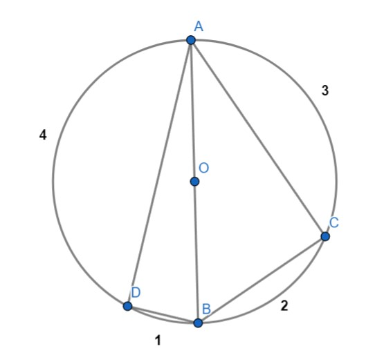

# Problem:  The circle of death


In the world of One Piece, there is a certain legend about a circle at sea where numerous ships vanished without a trace. This circle came to be known as the circle of death.
The straw hat pirates found themselves obligated to pass through this circle to reach a certain island.
Nami, their bright navigator, uncovered the secret behind this phenomenon.
She found out three key observations about the circle:
- The circle of death is formed by **n** specific points.
- Within the circle of death, there are danger zones and safe zones.
- The danger zones are the **right triangles** that can be formed using any 3 points from the **n** points forming the circle. 

Help Nami find the number of danger zones so that the ship can avoid them to reach their destination safely.

## Input Format


The first line contains an integer n(3 ≤ n ≤100000), the number of points.

The second line contains n space-separated integers **aᵢ**  $(1≤aᵢ≤10^9)$ -- the **length of the arc** between point i and point i+1 $(1≤i≤n−1)$, and aₙ is the distance between the point number n and the first point.

## Output Format
Output the number of unique danger zones that appear in the circle.

## Example:

Input :

```
4
3 2 1 4
```

Output :

```
2
```

Input :

```
3
1 2 3
```

Output :

```
1
```



